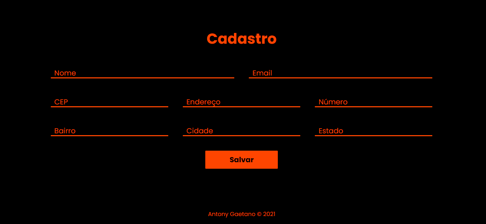
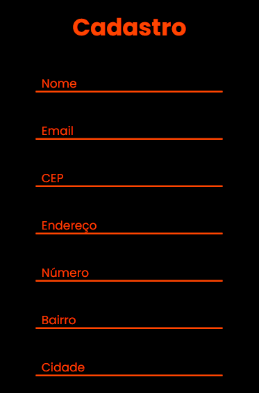

# API CEP

### Esse projeto foi desenvolvido para consumir dados de uma API!

- Foi usado o fetch para fazer o cosumo da API dos Cep das cidades Brasileiras!
- Por meio desse projeto pode-se ter os dados de mais de 200 paises pelo o mundo!
- Atráve do cep informado pode se ver:
  - O bairro
  - A cidade
  - O estado
  - O endereço

### Layout para notebook e desktop

### Layout para celulares e tablets

🚀Tecnologias usadas:
- ✔HTML
- ✔CSS
- ✔JAVASCRIPT

